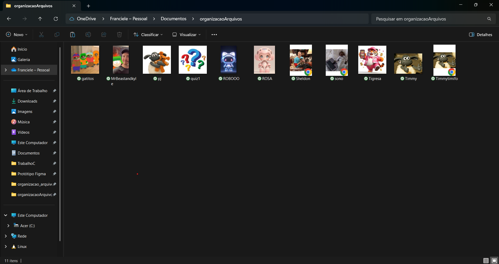
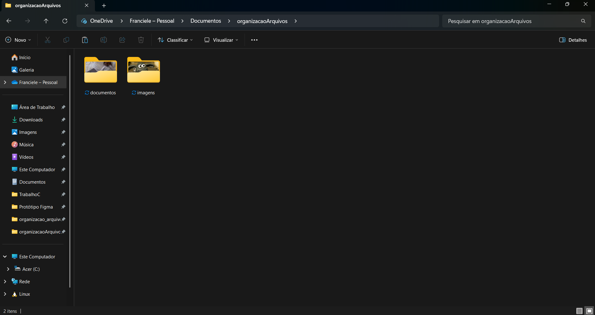

# Organizador de Arquivos  

Este projeto em Python organiza automaticamente arquivos dentro de uma pasta selecionada, movendo-os para subpastas de acordo com sua extensão (imagens, documentos, áudios, vídeos, compactados e outros).

## Tecnologias utilizadas

- Python 3

- Biblioteca os

- Biblioteca tkinter

## Funcionalidades

- Seleção de uma pasta através de uma janela gráfica.

- Identificação dos arquivos pela extensão.

- Criação automática de pastas caso não existam.

- Movimentação dos arquivos para suas respectivas categorias:

imagens: .png, .jpg, .jpeg, .gif, .bmp, .tiff

documentos: .pdf, .doc, .docx, .txt, .xls, .xlsx, .ppt, .pptx

áudio: .mp3, .wav, .aac, .flac, .ogg

vídeos: .mp4, .avi, .mov, .mkv, .flv

compactados: .zip, .rar, .tar, .gz, .7z

outros: .csv, .json, .xml, .html, .css, .js

## Como usar

1. Clone este repositório:

   ```bash
   git clone https://github.com/seu-usuario/OrganizadorArquivos.git

2. Vá até a pasta do projeto:

   ```bash
   cd OrganizadorArquivos

3. Execute o script:

   ```bash
   python main.py

4. Execute o script:

    ```bash
   python main.py

5. Escolha a pasta que deseja organizar.

6. O script moverá automaticamente os arquivos para pastas correspondentes por tipo.

## Funcionamento do Projeto

### - Antes

<!-- markdownlint-disable MD033 -->
<figure>
    
    <figcaption>Arquivos na pasta antes da ordenação por tipo.</figcaption>
</figure>
<!-- markdownlint-enable MD033 -->

### Depois

<!-- markdownlint-disable MD033 -->
   <figure>
        
        <figcaption>Arquivos na pasta organizados por tipo.</figcaption>
    </figure>
</div>
<!-- markdownlint-disable MD033 -->
